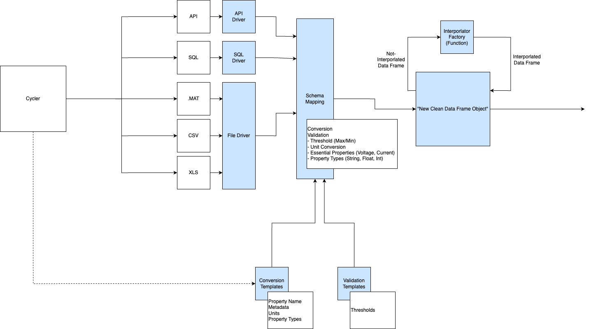

# Quick Start

## Deploy Locally

Steps. To. Deploy

## Deploy on AWS

Steps. To. Deploy

# Conceptual Schematic Diagram

AmpLabs Cloud Service realizes this conceptual idea

# How to Contribute:

## Suggest Improvements
1. Report bugs, feature or change requests by clicking 'Issues' on top bar
2. Fill out form documenting improvement you would like to see.
3. Label appropriately
4. Assign Issue to Milestone (optional)
5. Assign Issue to Project (optional)

## Develop Code or Write Documentation

1. Fork Repository by clicking 'Fork' on top right of this page.
2. Create branches to develop new code.
3. When complete submit a 'Pull Request' from repository and assign to a Maintainer for review
